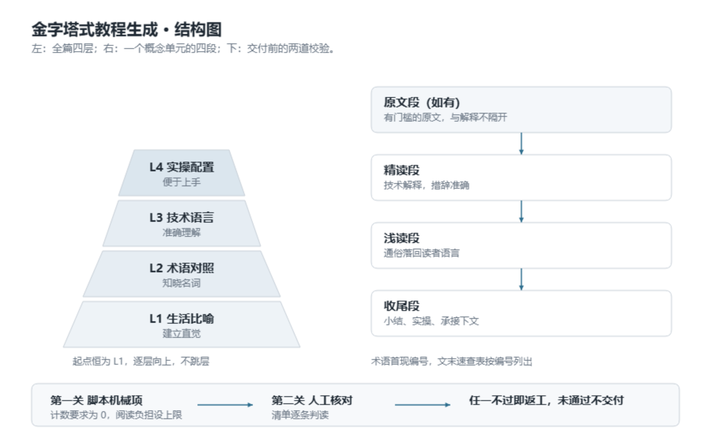

# pyramid-tutorial

金字塔式教程生成。名字来自它的形状：塔基最宽，人人能读；往上逐层收窄，走到顶层就能自己动手。

四层从下往上：

- L1 生活比喻，建立直觉。
- L2 术语对照，知晓名词。
- L3 技术语言，准确理解。
- L4 实操配置，便于上手。

每层只比上一层多一级台阶，绝不跳层。读者在任意一层停下，都能带走一块完整理解。

生成任何一篇教程，起点恒为 L1。读者熟悉到哪一层，只决定各层写多写少，不决定从哪层开始。

输入一个主题名，产出一篇零基础读者能从直觉读到上手的完整教程。

- 输入：一个主题名。其余项按默认值执行，不追问。
- 产出：单个 Markdown 文件。结构固定，附术语速查表、章末自检与常见困惑。
- 保障：十条规则边界与两段式自检。机械项跑脚本，人工项逐条核对，不过不交付。

整体结构如下图所示。



图一：左侧为全篇四层，右侧为一个概念单元的四段，底部为交付前的两道校验。

## 1 适用场合

把有门槛的主题讲给没有背景的读者时适用。新人培训、概念科普、上手指南、入职教材，或把已有材料改写成能独立阅读的分层读物。

不适用三种情况：碎片式问答；无教学目的的创作；已有清晰对话上下文的增量改写。

## 2 解决的问题

直接让模型讲一个技术主题，常见三种结果：术语堆砌、层级混乱、读起来像说明书。三种结果都把读者留在半路。

本技能把「讲透一个概念」拆成固定动作，按上述四层顺序推进，不依赖单次生成的手感。

结构与质量可复现。十条规则边界约束语言与排版，两段式自检在交付前拦下问题，同一主题反复生成也能保持相同结构。

概念单元由四段构成，顺序固定：原文段（有门槛的原文，如有）→ 精读段（技术解释）→ 浅读段（通俗落回）→ 收尾段（小结、实操与承接）。术语首现处标编号，文末速查表按编号列出。

概念之间还有一条顺序要求，规则里叫「先讲前置概念」：讲解某个概念时，只能引用排在它前面且已讲完的前置概念，不得引用后面才讲的高级术语。

## 3 使用方式

最小输入是一个主题名。默认受众为只具备高中阶段通用基础知识的读者，四层全开，比喻系统选定后全篇锁定。

可直接照用的说法：

- 用金字塔式教程生成一篇 RAG 教程
- 给零基础的人讲透 MCP
- 这篇文章太深了，术语太多，改成分层教程
- 生成一份新人上手指南，禁用词：XXX

可指定项（可选）：受众、深度（截断到第几层并声明）、比喻系统、禁用词、撰写者署名。缺失项按默认值执行，文首「本篇约定」写明取值，读者可据此要求重生成。

## 4 产出结构

结构固定。节名措辞可微调，四层顺序与编号规则不变。

```
# 教程名称
（元信息：版本号 / 撰写者 / 总字数 / 预计阅读时间 / 主题简述）
（本篇约定：受众 / 比喻系统 / 涵盖范围 / 默认假设）
## 1 概念名
（原文：有门槛的原文，如有）
### 1.1 生活场景
### 1.2 正式名字
### 1.3 准确地说
### 1.4 动手试试
**章末自检**
**本章名词**：1 术语、2 术语
## 2 概念二
## N 术语速查表
## N+1 常见困惑
```

概念数量按依赖关系排序，三到六个，先被依赖的先讲。完整示例见 `examples/rag-tutorial.md`。

## 5 校验机制

生成后执行两步校验，任一不过即修复重跑。

第一步跑脚本，查机械项。AI 套话、感叹号、省略号、修订说明类词句、写作过程的话、五级标题、章末勾选框，全部要求为 0。阅读负担也在这里查：单句字数、分句数、并列项数按层设上限，超了判为不通过。

```
bash scripts/selfcheck.sh 产出文件.md
```

第二步核对人工项。L1 零术语、小白复读、不引入新词解释旧词、比喻一致、要素完整、因果链完整、自然引导、先讲前置概念、用词通俗、四段顺序与术语编号。判读标准见 `references/selfcheck.md`。

## 6 安装方式

方式一，复制目录到技能目录。WorkBuddy 用户级目录为 `~/.workbuddy/skills/pyramid-tutorial/`。

方式二，从 GitHub 安装。

```
git clone https://github.com/QQFFGG888/pyramid-rules.git pyramid-tutorial
```

方式三，技能市场上架后，在 WorkBuddy 技能入口搜索「金字塔式教程生成」安装。

## 7 目录结构

```
pyramid-tutorial/
├── SKILL.md                    # 技能主文件：触发条件、三条立意、先讲前置概念、生成流程、输出格式
├── references/
│   ├── pyramid-rules.md        # 四层填充规则、单元四段、术语编号、铁律、正反例
│   ├── blocks.md               # 可复用区块模板：元信息、原文段、自检等
│   └── selfcheck.md            # 自检清单与人工项判读标准
├── examples/
│   └── rag-tutorial.md         # 单概念完整教程示例
├── scripts/
│   └── selfcheck.sh            # 机械计数项自检脚本
├── docs/
│   ├── architecture.html       # 结构图的 canvas 源码，可改后重新导出
│   └── architecture.png        # 结构图，供文档与页面引用
├── README.md                   # 仓库说明：适用场合、用法、产出、安装与版本
├── _icon.png                   # 技能图标，512×512
└── LICENSE                     # MIT
```

## 8 许可与版本

MIT License，见 LICENSE。

v5.1.1。术语改名与文案去行话：依赖闭合改为先讲前置概念，理解成本改为阅读负担，带病交付改为未通过前不交付，自检配方改为自检清单；修正语句不通与指标数量笔误。v5.1。新增三条立意、前置概念顺序规则、读者起点判断、阅读负担阈值与用词通俗规则；自检脚本增阅读负担检查四项；单元四带改名单元四段，此前生造的压缩词与比喻式命名全部换成直白说法。此前版本：v5 单元四带落地，术语编号、章末名词与文末四列速查表；v4 目录结构升级，示例迁至 examples/，自检清单写成 scripts/selfcheck.sh；v3.1 规则措辞与默认值精修；v3 四层金字塔与十条规则边界成型。
